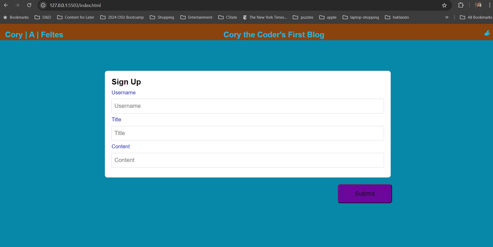
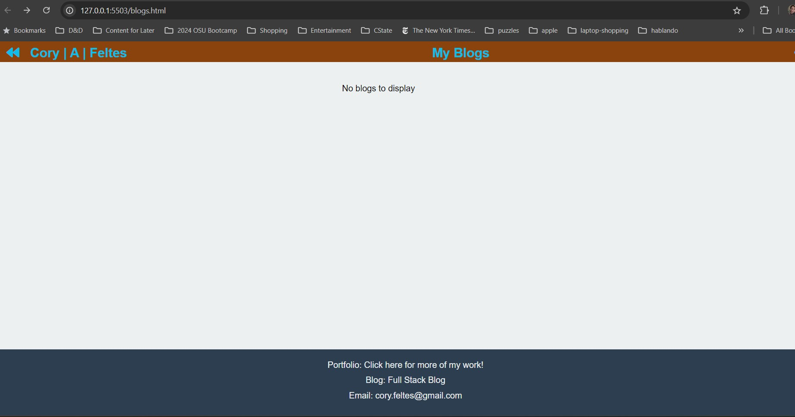

# Personal-Blog-H4
Fourth homework challenge

## Description
Fourth homework assignment - Personal Blog

## Table of Contents
- [User-Story] (#User Story)
- [Acceptance-Criteria] (#Acceptance-Criteria)
- [Installation](#installation)
- [Usage](#usage)
- [Contributing](#contributing)
- [License](#license)
- [Acknowledgments](#acknowledgments)

## User Story
AS A marketing student
I WANT a personal blog
SO THAT I can showcase my thoughts and experiences

## Acceptance-Criteria
GIVEN a personal blog
WHEN I load the app,
THEN I am presented with the landing page containing a form with labels and inputs for username, blog title, and blog content.
WHEN I submit the form,
THEN blog post data is stored to localStorage.
WHEN the form submits,
THEN I am redirected to the posts page.
WHEN I enter try to submit a form without a username, title, or content,
THEN I am presented with a message that prompts me to complete the form.
WHEN I view the posts page,
THEN I am presented with a header, with a light mode/dark mode toggle, and a "Back" button.
WHEN I click the light mode/dark mode toggle,
THEN the page content's styles update to reflect the selection.
WHEN I click the "Back" button,
THEN I am redirected back to the landing page where I can input more blog entries.
WHEN I view the main content,
THEN I am presented with a list of blog posts that are pulled from localStorage.
WHEN I view localStorage,
THEN I am presented with a JSON array of blog post objects, each including the post author's username, title of the post, and post's content.
WHEN I take a closer look at a single blog entry in the list,
THEN I can see the title, the content, and the author of the post.
WHEN I view the footer,
THEN I am presented with a link to the developer's portfolio.

## Installation
Step-by-step instructions on how to install and set up your project.

Creating a template for displaying my resume, projects, and development as a coder for potential future employers

## Usage
Instructions on how to use your application.

Visit my sites here!
https://CFeltes.github.io/Personal-Blog-H4/
https://github.com/CFeltes/Personal-Blog-H4

## Contributing
Guidelines for contributing to the project.
Contributors were the author of the source code, AI, help from the program's tutors, and owner of this repository (Cory Feltes) 

## License
This project is licensed under the MIT License - see the [LICENSE.md](LICENSE.md) file for details.

## Acknowledgments
Used syllabus/course resources as well as AI resources to check my work.

## Contact Information
Cory Feltes - cory.feltes@gmail.com

//Make sure to keep your README updated as your project evolves!